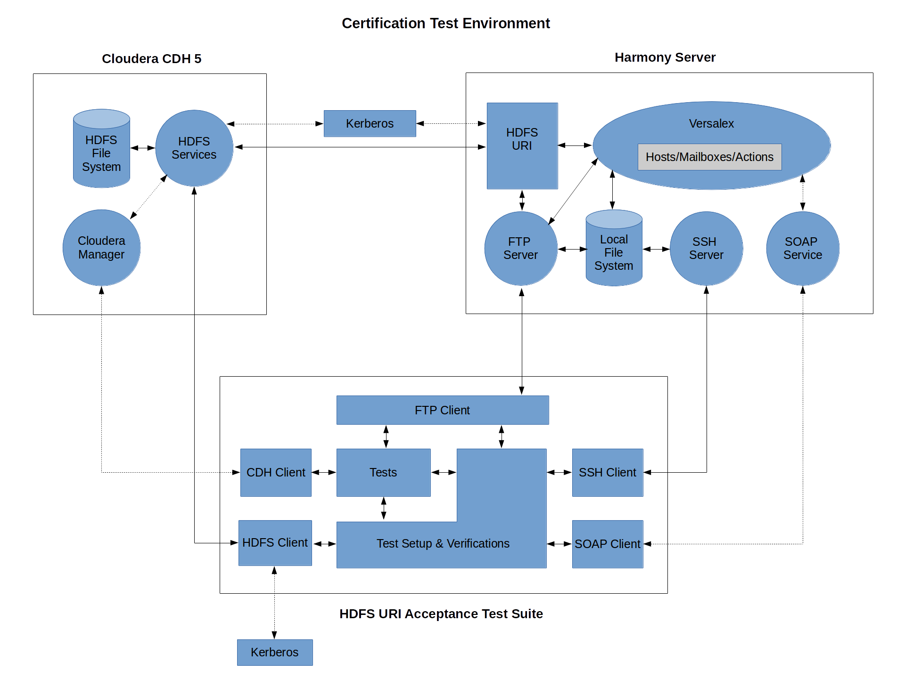

.. default-role:: code

==============================
HDFS URI Acceptance Test Suite
==============================

.. contents:: Table of contents:
   :local:
   :depth: 2

Overview
========

There are 101 tests in total:

* 35 `Smoke Tests <src/test/robotframework/tests/10__smoke/README.rst>`_
* 64 `Acceptance Tests <src/test/robotframework/tests/20__acceptance/README.rst>`_
* and 2 additional '*tests*' for `Provisioning <src/test/robotframework/tests/00__provision.rst>`_/`Teardown <src/test/robotframework/tests/99__teardown.rst>`_ of the test environment

The tests are *self-documenting* executable `Robot Framework <http://robotframework.org/>`_ test suite/test case files packaged as a self-contained maven project.

The only external requirement is Python 2.7.x installed locally to provision/teardown the test environment - not required if only running tests against an existing environment.

Test Environment:

* MIT Kerberos 5 version 1.12
* Harmony 5.3.0.3 Standalone with HDFS URI installed - no VLProxy
* CDH 5.5.4 Cluster w/Kerberos authentication
    * 1 node for CDH Manager
    * 3 nodes for replicated HDFS file system
    * 2 nodes for name service - 1 primary/1 secondary configured for HA
    * 1 node for other Hadoop services (YARN/ZooKeeper)

   
The test environment is hosted on AWS and an account with IAM privileges is required in order to authenticate to Amazon and provision the environment. Generate an `AWS Access Key ID` and an `AWS Secret Access Key` and then set the following environment variables before attempting to create a new test environment::

    export AWS_ACCESS_KEY_ID=<your aws access key id>
    export AWS_SECRET_ACCESS_KEY=<your aws secret access key>

Test Suite
==========

The test suite is run via maven. The default goal of the maven project is 'clean verify' so simply typing `mvn`
will run all of the tests.

Since provisioning a new test environment is a very time consuming operation it needs to be explicitly requested
via `mvn -Dprovision=true` and teardown also needs to be explicitly requested via `mvn -Dteardown=true`

Once an environment has been provisioned the tests may be run as many times as required before tearing
it back down.

* `Test Suite <src/test/robotframework/tests/README.rst>`_
* `Sample Results <http://cleo-sample-test-report.s3-website-us-west-1.amazonaws.com/report.html>`_

Jenkins job
===========

There is a Jenkins job that can be run on demand:

* Provisions the test execution environment
* Runs the test suite
* Tears down the test execution environment

Note: AWS credentials are not required to run the Jenkins Job, there is a set of credentials pre-configured for the job.
